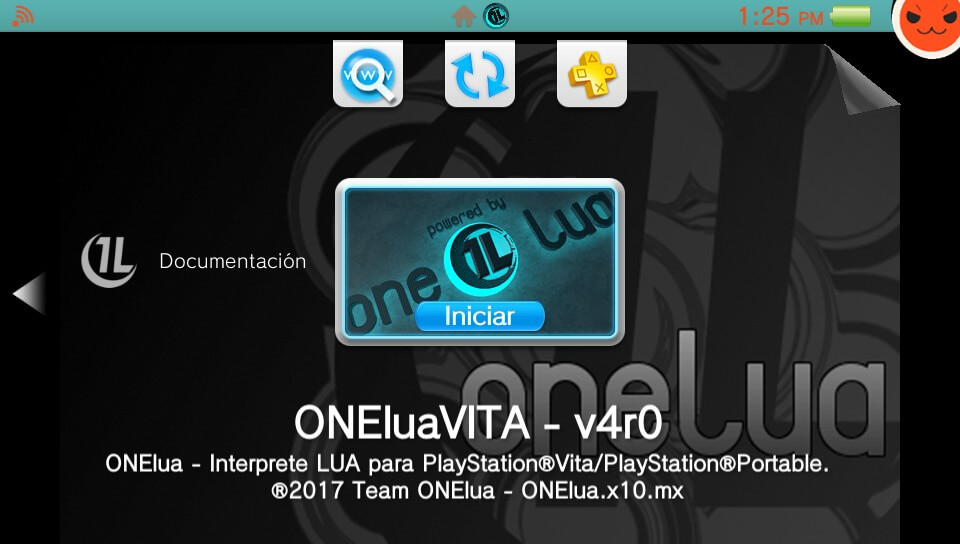
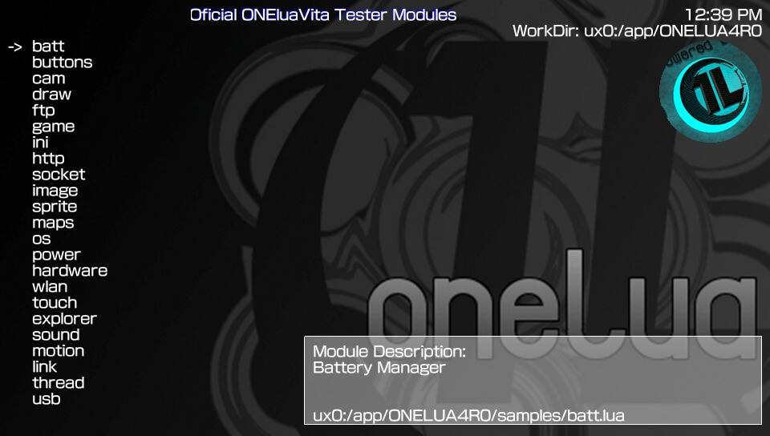

# ONEluaVita 

Lua Interpreter for PlayStation®Vita.

### Description ###
ONELua is a multiplatform project designed to facilitate programming for both programmers and those who are not, with the arrival of Henkaku by Team Molecule, finally vita was accessible and any user could use Homebrew's, at that time we decided that it was time to port ONElua and create a full version for PlayStation Vita.

Because it is still in the early vitasdk, lack of samples, time required to perform all the coding and testing personally, so the first version comes with such a delay from the onset of henkaku.

Here are the main functions of ONElua for PSP but of course, with new and special functions for PSVita.

### Main features ###
- Ported to be 100% compatible with taiHEN and use the maximum of functions.
- Handling peripherals:
	* Physical buttons or controls.
	* Camera (Front and back).
	* Motion (Accelerometer, gyroscope).
	* Touch (Front and back).
- Many constants have been updated, please check the constatnts you are using with new changes on the Documentation.
- New functions for the camera module and updated incorporated constants for the module.
- Optimization of the files module (Please check our Documentation).
- The OSK (On Screen Keyboard) module has been re-written, now the OSK loads with the system language set on the PSVita.
- The OS module got new functions from wich we highlight:
	* os.getreg(), os.setreg() for the Registry Manager (/CONFIG/).
	* os.saveaccount(), os.restoreaccount(), os.removeaccount() for direct management of the files of your PSN Account.
- Optimization of the font module, now the default PGF and PVF font loading allows to use 3 fonts on the system: Korean, Latin and the set language font on the PSVita.
	* Added the possibility to load ttf, pgf or pvf fonts.
	* Added the possibility to load a default font: onefont.pgf if there alongside our EBOOT.BIN, otherwise load the default font. Simply place the source properly renamed onefont.pgf and thus the eboot of ONElua can start our Homebrew with this default Font.
- Optimization of the game module, with new attractive functions:
	* game.mount(), game.umount(), game.rif(),game.frif(),game.refresh(). Thanks to the_Flow.
	* Added possibility to Install/Update/Uninstall Homebrew's from folder and in vpk format.
	* Updated function game.info(), now get data of .sfo, eboot.pbp or VPKs/ZIPs.
	* game.list(), Has been optimized so the installed apps list on the PSVita can be loaded faster, reading them straigth from the app.db.
- New functions for the image module, such as image.save() which can be used to convert images to 8 Bits
- Added the module 'thread' & 'channel', which allow ONElua to run multiple processes.
- Improved audio player, now plays MP3, OGG, WAV formats, and plays from sources on the network.
- In full access mode, the "app0:" partition is removed, and added support writing on the route of the app ("ux0:/app/<ID>").
- It allows to enable unsafe or total mode on the console os.master().
- It allows to know access mode in the console (Safe or Unsafe) os.access().
- Added the ability to go to 'LiveArea' without closing the application or press the 'PS' os.golivearea().
- Added the ability to update or rebuild the 'LiveArea' database os.updatedb() & os.rebuilddb().
- Added the possibility of reload the config.txt from taiHEN os.taicfgreload().
- Added the possibility of Install/Update/Uninstall CustomThemes of 'LiveArea'.
- Added ONEdebugger - Real-time debugger errors in your scripts. 
- Optimization of our Callbacks and the possibility to stop or abort processes in the callback, check the Callbacks section for more information..
- Added the possibility to load maps (tiles) and draw.
- Added the Lua Bit library that allows level operations bit by bit.
- Added several 'PATCH' to extend the syntax of lua, examples:
	* C Type operations: "sum: +=, subtraction:-=, multiplication: *=, division: /=, power: ^=, mod: %=, different: !=, division does not float: \"
	* C bit operations: "and: &, or: |, not: ~, shift left: <<, right shift: >>"
	* Operations continue, "skips a cycle", in any loop.

### TO-DO ###
- Fully optimize the code and release the source code (This task is delayed due to lack of time).

### Report bugs ###
if you see something wrong, please submit an issue or pull request.

### Credits ###
- **Team Molecule** for HENkaku and taihen.
- All people contributed creating Plugins.

## Donation ##
In case you want to support the work of the team on the vita, you can always donate for some coffee. Any amount is highly appreciated:

